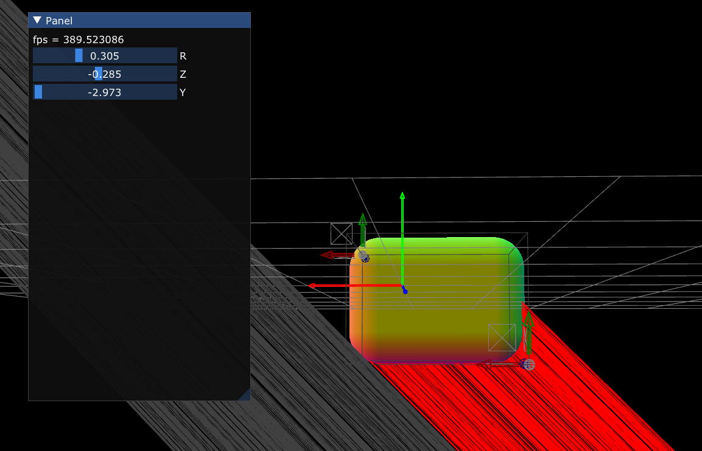

## Ray - Rounded box intersection

Based on https://www.shadertoy.com/view/WlSXRW 
However, a single sphere intersection with a flipping octant is not enough because **even if the box intersection occurs on an octant, the true intersection can be on the other side of octants due to cylinder edges.** Also, the original code does not take ray casts from inside into account. So this code supports: 

- Robust corner sphere handling
- Back face culling

